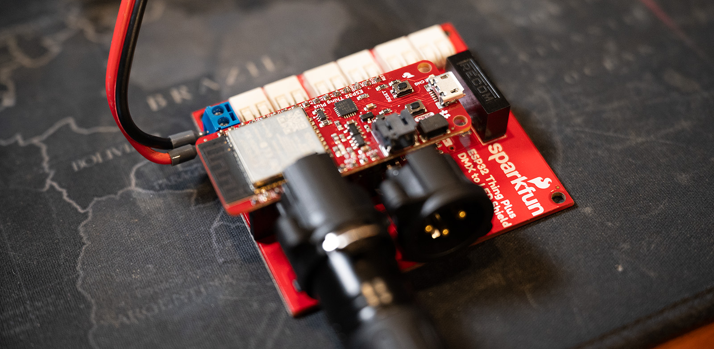

# Apollo DMX Bridge

Simple control of DMX fixtures over a web interface & HTTP API. 
Intended to allow DMX fixtures to integrate into any home automation setup. 

**Features**
- Get and update DMX fixture presets or scenes
- Artnet manual relay mode to enable a 3rd party controller
- An HTML front-end for manual control and debugging
- Delayed power off relay trigger allowing for fan cooldown

**Supported Devices**
-  Sparkfun ESP32 Thing Plus with DMX to LED Shield
-  Any DMX based fixture that fits within 1 universe (512 channels)

**Dependencies**
- [SparkFun DMX Shield Library](https://github.com/sparkfun/SparkFunDMX)

## How it works

The `fixtureConfig.cpp` stores an array of fixtures and scenes. Each fixture can have an array of presets which is the value for each channel used by the fixture. The scenes specify a desired preset for each fixture. 

Access via web interface http://dmx.local 

## Use of API

    <code>GET</code> <b>/getFixturePreset</b> - Return the fixture's active preset

###### Parameters

> | name      |  type     | data type               | description                                                           |
> |-----------|-----------|-------------------------|-----------------------------------------------------------------------|
> | id      |  required | string   | Fixture's id  |

    <code>POST</code> <b>/updateFixture</b> - Executes the fixture's preset

###### Parameters

> | name      |  type     | data type               | description                                                           |
> |-----------|-----------|-------------------------|-----------------------------------------------------------------------|
> | id      | required  | string    | Fixture id    |
> | preset  | required  | string    | Preset id     |

    <code>GET</code> <b>/getScene</b> - Return the active scene

###### Parameters

None

    <code>POST</code> <b>/updateScene</b> - Executes the scene 

###### Parameters

> | name      |  type     | data type               | description                                                           |
> |-----------|-----------|-------------------------|-----------------------------------------------------------------------|
> | id      | required  | string    | Fixture id        |
> | command | optional  | string    | `on` (default)  or `off`      |

## Installation

> [!IMPORTANT] 
> This application ONLY works with the older version of SparkFun DMX Shield Library v1.0.5

1) Update the credentials.h with your WiFi information
2) Setup your own `fixtureConfig.cpp`
3) Update the `data/index.html`
4) Install `SparkFun DMX Shield Library version 1.0.5` within Arduino IDE
5) Flash to a [Sparkfun ESP32 Thing Plus](https://www.sparkfun.com/products/15663) microcontroller via Arduino IDE
6) [Upload](https://randomnerdtutorials.com/install-esp32-filesystem-uploader-arduino-ide/) the sketch data folder for the web interface via SPIFFS
7) Connect to a [SparkFun ESP32 Thing Plus DMX to LED Shield](https://www.sparkfun.com/products/15110)

## Important Limitations & Notes

1) With my controller, I am **unable to monitor the serial port** and connect to the wifi router at the same time. I am not sure if this is a limitation of this controller when using it with the DMX libraries.

2) This uses the older version of the Sparkfun DMX libraries. It breaks with the most recent version and I have not yet diagnosed the problem.
   
3) This version does NOT work with the [SparkFun Thing Plus - ESP32-S2](https://www.sparkfun.com/products/17743) with the USB-C connector. There was recently an overhaul of the SparkFun DMX library and should correct [this issue](https://github.com/sparkfun/SparkFunDMX/issues/10) once this code is updated to use the new library.

## Versions in my testing

Using board 'esp32thing_plus' from platform in folder: /Users/ray/Library/Arduino15/packages/esp32/hardware/esp32/2.0.13
Using core 'esp32' from platform in folder: /Users/ray/Library/Arduino15/packages/esp32/hardware/esp32/2.0.13

Using library WiFi at version 2.0.0 in folder: /Users/ray/Library/Arduino15/packages/esp32/hardware/esp32/2.0.13/libraries/WiFi 
Using library ESP Async WebServer at version 1.2.3 in folder: /Users/ray/Documents/Arduino/libraries/ESPAsyncWebServer-master 
Using library FS at version 2.0.0 in folder: /Users/ray/Library/Arduino15/packages/esp32/hardware/esp32/2.0.13/libraries/FS 
Using library AsyncTCP at version 1.1.4 in folder: /Users/ray/Documents/Arduino/libraries/AsyncTCP 
Using library SparkFun DMX Shield Library at version 1.0.5 in folder: /Users/ray/Documents/Arduino/libraries/SparkFunDMX-master 
Using library ArtnetWifi at version 1.5.1 in folder: /Users/ray/Documents/Arduino/libraries/ArtnetWifi-master 
Using library ESPmDNS at version 2.0.0 in folder: /Users/ray/Library/Arduino15/packages/esp32/hardware/esp32/2.0.13/libraries/ESPmDNS 
Using library SPIFFS at version 2.0.0 in folder: /Users/ray/Library/Arduino15/packages/esp32/hardware/esp32/2.0.13/libraries/SPIFFS 
Using library HTTPClient at version 2.0.0 in folder: /Users/ray/Library/Arduino15/packages/esp32/hardware/esp32/2.0.13/libraries/HTTPClient 
Using library WiFiClientSecure at version 2.0.0 in folder: /Users/ray/Library/Arduino15/packages/esp32/hardware/esp32/2.0.13/libraries/WiFiClientSecure 